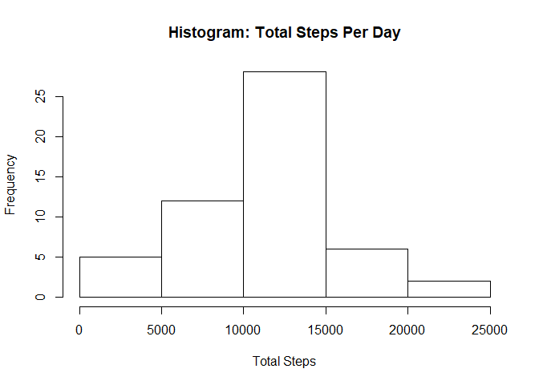
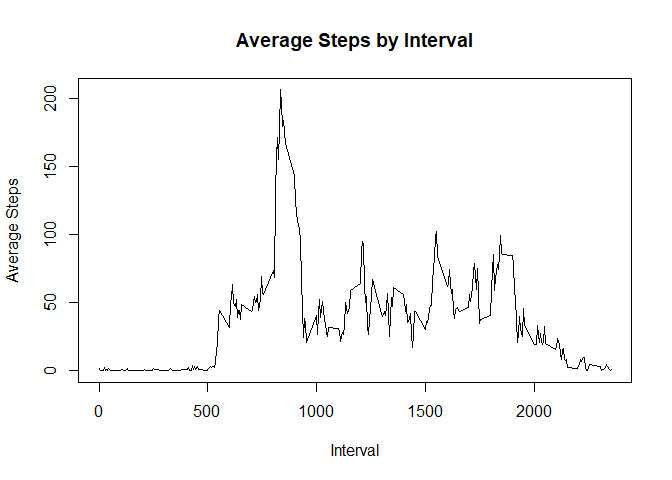

#**Course 5: Reproducable Research - Week 2 Project**

##Introduction
In order to use the data to answer the questions presented in the assignment, first we need to download and read the data into R. *Note: You will need to change the file paths to match your file structure and this code is intended for windows users.*


```r
fileurl <- "https://d396qusza40orc.cloudfront.net/repdata%2Fdata%2Factivity.zip"
download.file(fileurl, destfile = "C://Users//Anthony//Course5//data.zip")

#unpack the ziped file
In <- "C://Users//Anthony//Course5//data.zip"
out <- "C://Users//Anthony//Course5"
unzip(In,exdir=out)

setwd("C://Users//Anthony//Course5")

data<-read.csv("activity.csv")
```

Now that the data is in R, we can begin to shape the data and answer the questions

##**Question 1**

        1. Make a histogram of the total number of steps taken each day
        2. Calculate and report the mean and median of the total number of steps taken per day
        3. In order to find the total number of steps as well as the mean and medians, we will first need to group the data by date.**

For this code you will need to load the **"dplyr"** package into R.  Once the pachage is loaded, we group the data by date and the summarise the data using steps for the total.


```r
library(dplyr)
```

```
## 
## Attaching package: 'dplyr'
```

```
## The following objects are masked from 'package:stats':
## 
##     filter, lag
```

```
## The following objects are masked from 'package:base':
## 
##     intersect, setdiff, setequal, union
```

```r
dategroup <- group_by(data, date)
totalsteps <- summarise(dategroup, total = sum(steps))
```

Once the data is ready, we can plot a histogram showing the total number of steps per day.


```r
hist(totalsteps$total, main="Histogram: Total Steps Per Day", xlab = "Total Steps")
```

<!-- -->

Now we can figure the mean and median with a summary call on the **"totalsteps"** object we created.


```r
summary(totalsteps)
```

```
##          date        total      
##  2012-10-01: 1   Min.   :   41  
##  2012-10-02: 1   1st Qu.: 8841  
##  2012-10-03: 1   Median :10765  
##  2012-10-04: 1   Mean   :10766  
##  2012-10-05: 1   3rd Qu.:13294  
##  2012-10-06: 1   Max.   :21194  
##  (Other)   :55   NA's   :8
```

##**Question2**

        1. Make a time series plot (i.e. type = "l") of the 5-minute interval (x-axis) and the average number of steps taken, averaged across all days (y-axis)
        2.Which 5-minute interval, on average across all the days in the dataset, contains the maximum number of steps?
        

In order to answer this question we will again use the "by_group" method to group the data, but this time we will use the interval data to group by and omit the NA values.  Then we will summarise using the mean of the steps data as the total.


```r
intervalgroup<-group_by(data,interval)
nona<-na.omit(intervalgroup)
totalinterval<-summarise(nona, total = mean(steps))
```

Now we can create the plot.


```r
plot(totalinterval$interval, totalinterval$total, type = "l", main = "Average Steps by Interval", xlab = "Interval", ylab = "Average Steps")
```

<!-- -->

In order to figure the interval with the largest average steps we will sort the data by steps.


```r
sort<-arrange(totalinterval, desc(totalinterval$total))
sort
```

```
## # A tibble: 288 x 2
##    interval    total
##       <int>    <dbl>
##  1      835 206.1698
##  2      840 195.9245
##  3      850 183.3962
##  4      845 179.5660
##  5      830 177.3019
##  6      820 171.1509
##  7      855 167.0189
##  8      815 157.5283
##  9      825 155.3962
## 10      900 143.4528
## # ... with 278 more rows
```

The printed result shows interval 0835 as the interval with the largest average steps.

##**Question 3**

        1. Calculate and report the total number of missing values in the dataset (i.e. the total number of rows with NAs)
        2. Devise a strategy for filling in all of the missing values in the dataset. The strategy does not need to be sophisticated. For example, you could use the mean/median for that day, or the mean for that 5-minute interval, etc.
        3. Create a new dataset that is equal to the original dataset but with the missing data filled in.
        4. Make a histogram of the total number of steps taken each day and Calculate and report the mean and median total number of steps taken per day. Do these values differ from the estimates from the first part of the assignment? What is the impact of imputing missing data on the estimates of the total daily number of steps?
        
First we will get the total number of NA's in the data set.


```r
sum(is.na(data))
```

```
## [1] 2304
```

Now we replace the NA's with the mean for the 5 minute interval.


```r
steps_by_interval <- aggregate(steps ~ interval, data, mean)
data_imputed <- data
for (i in 1:nrow(data_imputed)) {
        if (is.na(data_imputed$steps[i])) {
                interval_value <- data_imputed$interval[i]
                steps_value <- steps_by_interval[
                        steps_by_interval$interval == interval_value,]
                data_imputed$steps[i] <- steps_value$steps
        }
}
data_imputed_step_by_interval <- aggregate(steps ~ date, data_imputed, sum)
```

A histogram of the new data shows a similar data set. And a summary call on the data both before and after the NA's were replaced shows the same mean, but slightly different medians.


```r
hist(data_imputed_step_by_interval$steps, main="Histogram of total number of steps per day (imputed)", 
     xlab="Total number of steps in a day")
```

<!-- -->

```r
summary(data_imputed_step_by_interval)
```

```
##          date        steps      
##  2012-10-01: 1   Min.   :   41  
##  2012-10-02: 1   1st Qu.: 9819  
##  2012-10-03: 1   Median :10766  
##  2012-10-04: 1   Mean   :10766  
##  2012-10-05: 1   3rd Qu.:12811  
##  2012-10-06: 1   Max.   :21194  
##  (Other)   :55
```

```r
summary(totalsteps)
```

```
##          date        total      
##  2012-10-01: 1   Min.   :   41  
##  2012-10-02: 1   1st Qu.: 8841  
##  2012-10-03: 1   Median :10765  
##  2012-10-04: 1   Mean   :10766  
##  2012-10-05: 1   3rd Qu.:13294  
##  2012-10-06: 1   Max.   :21194  
##  (Other)   :55   NA's   :8
```

##**Question 4**

        1. Create a new factor variable in the dataset with two levels - "weekday" and "weekend" indicating whether a given date is a weekday or weekend day.
        2. Make a panel plot containing a time series plot (i.e. type = "l") of the 5-minute interval (x-axis) and the average number of steps taken, averaged across all weekday days or weekend days (y-axis). See the README file in the GitHub repository to see an example of what this plot should look like using simulated data.
        

First we need to create the factor variables and prepare them for plotting.


```r
data_imputed['type_of_day'] <- weekdays(as.Date(data_imputed$date))
data_imputed$type_of_day[data_imputed$type_of_day  %in% c('Saturday','Sunday') ] <- "weekend"
data_imputed$type_of_day[data_imputed$type_of_day != "weekend"] <- "weekday"
data_imputed$type_of_day <- as.factor(data_imputed$type_of_day)
data_imputed_steps_by_interval <- aggregate(steps ~ interval + type_of_day, data_imputed, mean)
```

Then we construct the plot.


```r
library(ggplot2)
qplot(interval, 
      steps, 
      data = data_imputed_steps_by_interval, 
      type = 'l', 
      geom=c("line"),
      xlab = "Interval",
      ylab = "Number of steps", 
      main = "") +
        facet_wrap(~ type_of_day, ncol = 1)
```

```
## Warning: Ignoring unknown parameters: type
```

<!-- -->


